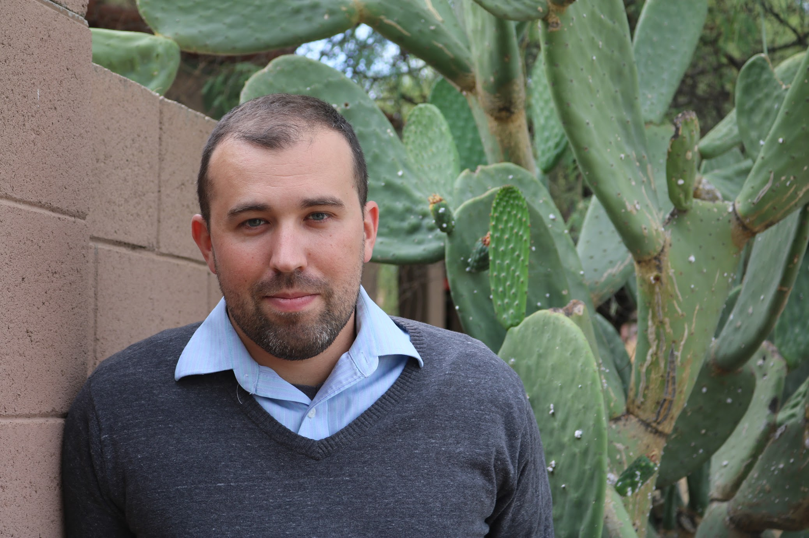

---
---

<link rel="stylesheet" href="styles.css" type="text/css">

I am a sociologist who studies culture, social networks, community, social organization, and the environment.

I am a doctoral candidate at the [University of Arizona School of Sociology](https://sociology.arizona.edu/), where [Dr. Ronald Breiger](http://www.u.arizona.edu/~breiger/) and [Dr. Brian Mayer](https://sociology.arizona.edu/user/brian-mayer) serve as my dissertation advisors.

My research investigates meso-level social contexts, such as fields and communities from a relational perspective.

My full CV is available [here](files/Puetz Kyle CV 2018 Public.pdf).
